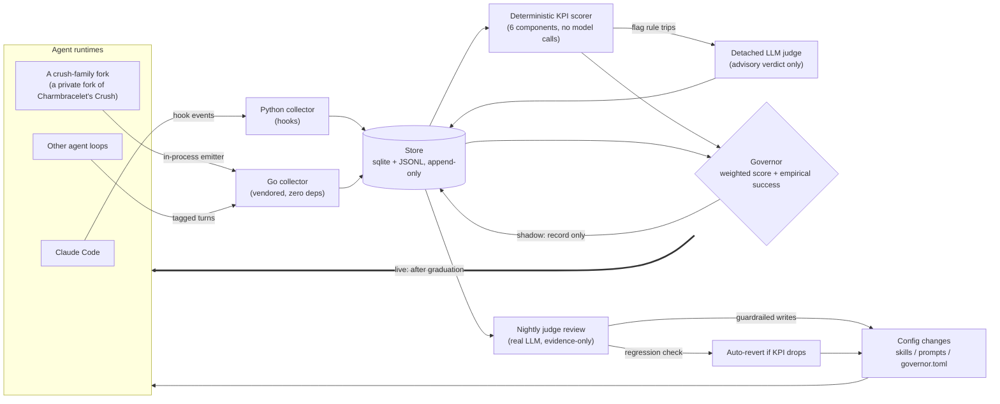
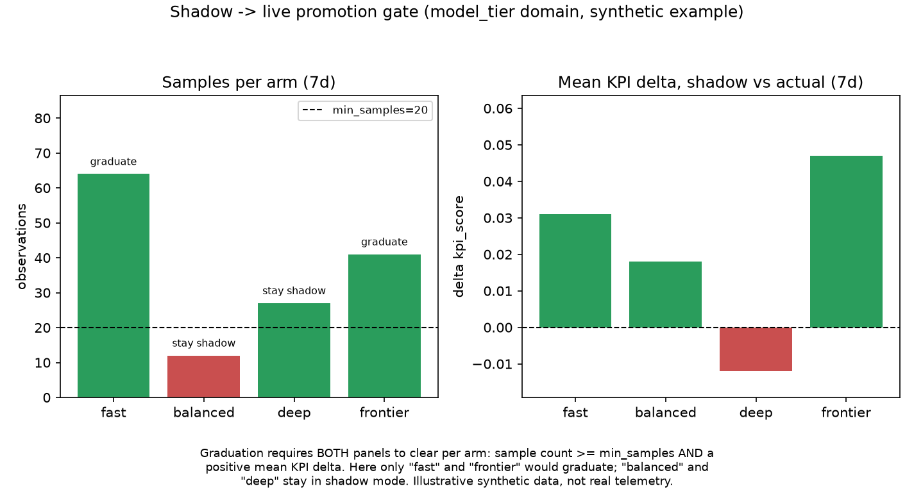

# Closed-Loop Telemetry and Judge-Guarded Self-Tuning for LLM Coding Agents

## Abstract

Coding agent harnesses make dozens of consequential decisions per turn — which model tier to
route to, which skills to inject, when to compact context, whether to delegate to a subagent —
and in most deployments none of it is measured. This repository is a working system, `flightdeck`,
that instruments every turn across multiple agent runtimes into one shared schema, scores each
turn deterministically against a six-component KPI, feeds that signal into a shadow-mode
*governor* that learns per-decision policy, and runs a nightly LLM-judged review that tunes the
system's prompts, skills, and weights from evidence rather than intuition. The repository also
documents a real defect found in this system — an **evaluator-contamination** bug where the
metric the judge was meant to validate leaked into the judge's own input — as a concrete case
study in why closed self-tuning loops need their own measurement discipline, not just a metric to
optimize.

## The problem

An agent harness routes each turn through a stack of decisions: which model tier serves it, which
skills get injected into context, when the context window gets compacted, whether a subagent
should be delegated to. Each of those decisions has a real cost (tokens, latency, correctness) and
a real alternative that wasn't taken. Historically, none of it was recorded. When a session goes
badly there is no artifact describing what the harness actually did — which tier it picked, which
skills it loaded but never used, whether compaction fired at the worst possible moment — so the
same class of failure recurs, and the only correction channel is a human noticing and writing
something down by hand.

Two problems compound this:

1. **No record → no comparison.** Without turn-level telemetry, you cannot ask "would a different
   tier have done better on this task shape?" — the counterfactual doesn't exist.
2. **A tuning loop is only as good as its evaluator.** Once you build a system that *changes its
   own configuration* from measured evidence, the measurement itself becomes the thing under test.
   An evaluator that is even partially derived from the same signal it's meant to validate stops
   being independent evidence — see [Evaluator contamination](#evaluator-contamination) below.

## System

Three components share one schema, deliberately: anything that can write the schema is a valid
telemetry source, and anything that can read it is a valid consumer. A Go emitter (vendored,
dependency-free, so it can be dropped into a forked agent CLI) and Python hook-based collectors
for Claude Code write to the same tables with nulls where a source is structurally blind (Claude
Code's hooks, for instance, cannot see token accounting mid-turn the way an in-process emitter
can).



### Turn-level telemetry (`turnlog`)

Every turn is recorded as one row in `turns`, plus a timestamped `events` stream (tool calls,
compaction, mode changes, MCP/LSP activity, skill loads vs. skill uses, delegation, edits and
reverts) and a redacted `texts` table with a bounded retention window. Two invariants matter more
than the schema itself:

- **A full telemetry queue drops events, it never blocks a turn.** The emitter's write path fails
  open for the turn and closed for the data: a dropped event is counted, not silently lost as
  "nothing happened."
- **Redaction happens at write time, in-process, and fails closed.** If the redactor errors, the
  text is discarded rather than stored raw. The Go and Python scrubbers are intentionally
  duplicated (the Go side must stay dependency-free) rather than shared, with the Python side
  authoritative on disagreement.

### KPI scoring

Each turn is scored at close, deterministically, from six components (`completion`,
`tool_reliability`, `efficiency`, `focus`, `context_health`, `autonomy`), weighted and summed into
one `kpi_score`. A turn is *flagged* — and queued for judge review — if it errored, the tool
failure rate exceeds a threshold, an edit-then-revert loop was detected, compaction fired
mid-turn, the user interrupted, or `kpi_score` falls below a threshold. Flagged turns are the only
ones that reach the LLM judge; the common path never makes a model call.

### The governor

The governor is a weighted-score selector (`score(arm) = Σ wᵢ·featureᵢ + β·empirical_success −
γ·cost`), not a trained model — it works from roughly 20 samples per arm and the weights file is
small enough for a human (or the nightly reviewer) to read and hand-edit, which a trained model's
weights are not. It covers four decision domains: `model_tier`, `skills`, `compaction`, and
`mode_delegation`.

**Every domain ships in shadow mode.** The governor computes and records what it *would have*
chosen — building a counterfactual against what actually ran — without changing system behavior.
A domain graduates to live control only when every one of its arms clears a minimum sample count
and shows a positive mean KPI delta over a trailing window; see
[Shadow-mode rollout](#shadow-mode-rollout) below. **In this repository, no domain has graduated:
the governor ships shadow-only.**

### Nightly judge review

A scheduled job sweeps the day's turns into three samples — the most complex turns, the
lowest-KPI turns, and a cheap pass over every session for problem signals (secrets caught by the
redactor, repeated tool failures, permission denials, silent collectors) — and hands them to a
real LLM review pass. The reviewer may only write a small, explicit whitelist of paths (skill
text, prompts, `governor.toml` numbers clamped to their declared min/max), enforced by tested code
(`deny` patterns are checked *before* `allow` patterns, so the reviewer cannot widen its own
authority by adding an allow entry), never by an instruction in a prompt a model could
reinterpret. Every change is its own commit with an evidence trailer; a nightly regression check
compares trailing KPI before/after each 2–14-day-old tuning commit and auto-reverts anything that
dropped the mean by more than a threshold with enough samples on each side — and a reverted change
joins a do-not-retry list so the same bad idea can't be re-derived from the same evidence.

## Evaluator contamination

The clearest lesson this project produced was a bug, not a feature. It's worth documenting in
full because it's a failure mode any judge-guarded tuning loop is exposed to, not something
specific to this codebase.

**The defect.** The judge's prompt included the turn's own `kpi_score` as context. That verdict
was then consumed as an *independent* signal in two other places: an outcome-scoring module
weighted it 2.0 *specifically* to correct for `kpi_score`'s own known bias, and a reward-model
module treated it as an external calibration set. Neither was true — the judge had already read
the number it was supposedly there to validate. A judge that can see the metric it's meant to
check is not a check on that metric.

**Why it mattered, measured.** Against the live store at the time (4,052 turns, 16,076 governor
decisions), the contamination was large enough to change conclusions about which *judge model* to
trust, not just fine-tune a probability: on the same tier and the same turn population, one judge
model passed frontier-tier turns 40.0% of the time (n=2,112) while a different judge model passed
them 86.2% of the time (n=318) — a 46-point swing attributable to judge identity alone, on turns
that should have looked identical to any judge. Removing `kpi_score` from the judge's input does
not make two judge models agree with each other; it removes the specific loop that made their
*disagreement* unmeasurable in the first place.

**The fix** (made in the private predecessor repo before this public release, whose history
starts fresh; the code here already includes it): the turn's `kpi_score` was removed from the judge's prompt entirely. A
second, related defect was fixed in the same change — the governor's `_choose` step already knew
whether a pick was the argmax choice or an epsilon-greedy exploration, and `record()` was
discarding both. Without that flag, the action-selection propensity `P(a|x)` is unrecoverable, and
every off-policy estimator (IPS, SNIPS, doubly-robust) is *undefined* on those rows, not merely
imprecise. A schema migration added `explored`, `reason`, and `epsilon` to `governor_decisions`,
carried on the choice itself rather than re-read from `governor.toml` later (the config file is
hand-edited between runs, so re-reading it at analysis time would silently misattribute historical
decisions to whatever epsilon happens to be configured *now*). Existing rows keep `explored = 0`
honestly, because every decision on record to that point was made under `shadow = 1`, where no
arm was ever actually acted on.

**The general lesson.** A metric that is allowed to influence the thing meant to validate it stops
producing independent evidence, even when the influence is indirect (a summary field in a prompt,
not a direct read of the training label). If you build a judge to check a score, audit every path
by which that judge's own input could have been shaped by the score — including "for context" —
before trusting judge/score agreement as evidence of anything.

## Shadow-mode rollout

Every governor domain begins in shadow mode by construction, and the graduation bar is
intentionally two-sided rather than sample-count-only:

1. **Coverage**: every configured arm has at least `min_samples` observations (default: 20) in
   the trailing window — an arm nobody has tried yet cannot be judged.
2. **Direction**: the mean KPI delta between turns where the governor's shadow choice matched what
   actually ran and turns where it didn't must be positive over that window — coverage alone
   doesn't tell you the shadow policy is *better*, only that it has an opinion.

The figure below works through a synthetic instance of exactly this rule for a hypothetical
`model_tier` graduation decision (the numbers are invented for illustration; no real telemetry is
shown or shipped in this repository):



Graduation is deliberately narrow: one domain per night at most, and flipping a domain live by
hand (outside the nightly reviewer) is explicitly discouraged, because doing so before evidence
accumulates is how you end up tuning weights against a success table that only ever saw one arm.
An epsilon-greedy exploration term and a minimum-sample floor with an optimistic prior for
under-sampled arms exist for the same reason: a selector that never explores an arm can never
accumulate the evidence needed to trust it.

## Limitations

- **The governor has not graduated any domain to live control in this repository.** Every number
  it produces is a shadow counterfactual, not a decision that changed agent behavior. Nothing here
  claims the learned policy outperforms the status quo in production — only that the mechanism for
  finding out, safely, exists and is tested.
- **This was built and measured against a single-operator fleet** (a handful of hosts, not a
  multi-tenant or enterprise deployment). The population-drift checks, sample-size floors, and
  session-grouped evaluation splits in `scope_eval.py` exist because even a single operator's
  corpus is small enough that naive metrics overstate confidence; a larger, multi-tenant
  deployment would need to revisit those constants, not just reuse them.
- **The nightly reviewer auto-applies to `main` unattended.** Guardrails (a deny-before-allow path
  whitelist, per-change commits, an evidence trailer, and an automatic regression-revert) bound the
  blast radius but do not eliminate the risk of an unattended write; that trade was accepted
  deliberately for this project, not by default.
- **The shipped correction-detection gold set is synthetic.** `tests/fixtures/correction_labels.json`
  is invented example text built to reproduce the same statistical shape (a regex baseline with
  high precision but low population-level recall) that a real hand-labelled corpus exhibited, not
  real session data — see the module docstring in `flightdeck/scope_eval.py`. Point `GOLD_PATH` at
  your own labelled data for real numbers; the shipped illustrative population constants are not
  measurements of anything.
- **The judge model is advisory, not authoritative**, and is typically a small local model, not a
  frontier one — its individual verdicts are noisy, which is exactly why the nightly reviewer reads
  judge output as evidence rather than a conclusion, and why the evaluator-contamination bug above
  was able to hide in the first place.

## Install / usage

```sh
git clone <this-repo>
cd closed-loop-agent-tuning
pip install -e '.[dev]'

python3 -m flightdeck init      # create the local telemetry store
python3 -m flightdeck doctor    # probe symlinks, migrations, collector liveness
```

### Bring your own inference endpoint

Nothing here is hardcoded to any particular fleet. The judge endpoints default to a local ollama
and are fully overridable:

| Env var | Default | Used by |
|---|---|---|
| `FLIGHTDECK_JUDGE_ENDPOINT` | `http://localhost:11434` | `flightdeck/judge.py` — the flagged-turn semantic judge |
| `FLIGHTDECK_JUDGE_MODEL` | `qwen3.8:27b` | same |
| `FLIGHTDECK_SCOPE_JUDGE_ENDPOINT` | `http://localhost:11434/api/chat` | `flightdeck/scope_judge.py` — the correction classifier |
| `FLIGHTDECK_SCOPE_JUDGE_MODEL` | `qwen3.8:27b` | same |
| `FLIGHTDECK_CONFIG_REPO` | `~/dev/my-agent-config` | `flightdeck/probes.py` — where your own dotfiles/config repo lives, for symlink health checks |
| `FLIGHTDECK_REVIEW_HOST` / `FLIGHTDECK_REVIEW_SSH_HOST` | `review-host` / `user@review-host` | `flightdeck/ledger_schedule.py` — the box that runs the nightly review chain |
| `SPARKY_SYNC_HOSTS` | (example placeholder) | `integration/systemd/sync-turnlogs.sh` — which boxes to pull turnlogs from |

Wiring a Go-based agent fork or a Claude Code install: see `integration/README.md`, then
`integration/crush/INTEGRATION.md` or `integration/claude-code/README.md`, then
`integration/systemd/README.md` for the nightly review timers. Deployment order matters and each
step is independently verifiable — the integration README explains why.

```sh
python3 -m flightdeck kpi --since 24h          # KPI rollup
python3 -m flightdeck sample --complex 10      # what the nightly pass would review
python3 -m flightdeck governor status          # per-domain shadow/live state and evidence
python3 -m flightdeck doctor                   # is anything silently not collecting?
```

### Testing

```sh
pip install -e '.[dev]' scikit-learn
python3 -m pytest
```

The suite is 868 tests (Python) plus a Go package (`go test ./...`) covering the schema contract
between the two emitter implementations, redaction, the governor's scoring and clamping logic, the
guardrail path-matching, and the KPI/judge evaluation harness.

## Repository layout

```
flightdeck/     Python package: collectors, store, KPI scorer, governor, judge, nightly review
go/turnlog/     Vendorable, zero-dependency Go telemetry emitter for a Go-based agent fork
integration/    Deployment guides: hooks, systemd units, crush-fork wiring, nightly-review skill
wiki/           Compiled project knowledge (KPI definitions, schema contract, guardrails)
docs/           Design artifacts and the evaluation figure
tests/          868 tests across the Python package
```

## License

MIT © Carter Schaefer — see `LICENSE`. Citation metadata in `CITATION.cff`.
